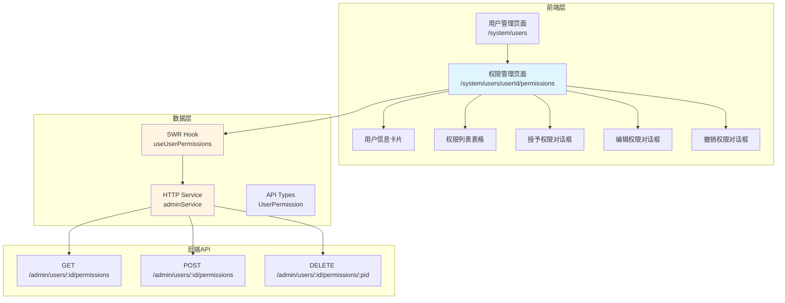
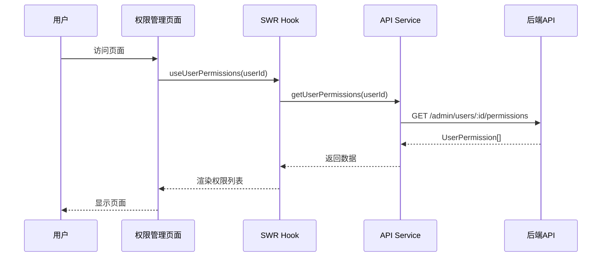
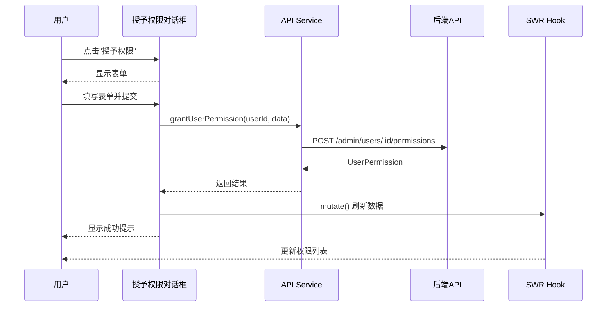
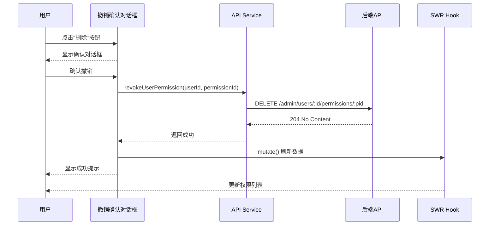
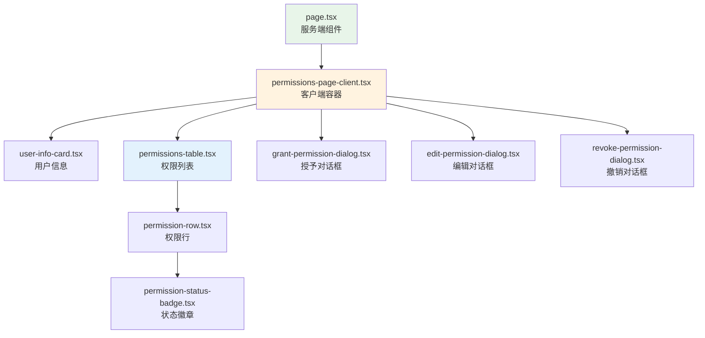

# 用户权限管理页面实现计划

## 概述

本文档提供用户权限管理页面的详细实现计划，包括任务分解、技术架构、数据流程和实现步骤。

## 系统架构



## 数据流程

### 1. 查看权限列表流程



### 2. 授予权限流程



### 3. 撤销权限流程



## 组件层次结构



## 实现任务清单

### 阶段 1: 基础设施（1-2小时）

- [ ] **任务 1.1**: 添加 API 类型定义
  - 文件: `frontend/lib/api-types.ts`
  - 添加 `UserPermission` 接口
  - 添加 `GrantPermissionRequest` 接口
  - 预计时间: 15分钟

- [ ] **任务 1.2**: 扩展 HTTP 服务
  - 文件: `frontend/http/admin.ts`
  - 添加 `getUserPermissions` 方法
  - 添加 `grantUserPermission` 方法
  - 添加 `revokeUserPermission` 方法
  - 预计时间: 20分钟

- [ ] **任务 1.3**: 创建 SWR Hook
  - 文件: `frontend/lib/swr/use-user-permissions.ts`
  - 实现 `useUserPermissions` Hook
  - 配置缓存策略
  - 预计时间: 20分钟

- [ ] **任务 1.4**: 定义权限类型常量
  - 文件: `frontend/lib/constants/permission-types.ts`
  - 定义 `PermissionTypeMetadata` 接口
  - 配置 `PERMISSION_TYPES` 常量数组
  - 预计时间: 25分钟

- [ ] **任务 1.5**: 添加国际化文案
  - 文件: `frontend/lib/i18n/permissions.ts`
  - 添加中英文翻译
  - 更新 `frontend/lib/i18n/index.ts` 导出
  - 预计时间: 30分钟

### 阶段 2: UI 组件开发（3-4小时）

- [ ] **任务 2.1**: 创建用户信息卡片组件
  - 文件: `frontend/app/system/users/[userId]/permissions/components/user-info-card.tsx`
  - 显示用户基本信息
  - 显示角色标签
  - 显示账户状态
  - 预计时间: 30分钟

- [ ] **任务 2.2**: 创建权限状态徽章组件
  - 文件: `frontend/app/system/users/[userId]/permissions/components/permission-status-badge.tsx`
  - 实现有效/已过期状态显示
  - 根据过期时间自动判断状态
  - 预计时间: 15分钟

- [ ] **任务 2.3**: 创建权限列表表格组件
  - 文件: `frontend/app/system/users/[userId]/permissions/components/permissions-table.tsx`
  - 实现表格布局
  - 显示权限信息
  - 集成编辑和删除按钮
  - 处理空状态
  - 预计时间: 45分钟

- [ ] **任务 2.4**: 创建授予权限对话框
  - 文件: `frontend/app/system/users/[userId]/permissions/components/grant-permission-dialog.tsx`
  - 实现表单布局
  - 权限类型选择器
  - 条件显示权限值输入
  - 过期时间选择器
  - 备注输入框
  - 表单验证
  - 预计时间: 60分钟

- [ ] **任务 2.5**: 创建编辑权限对话框
  - 文件: `frontend/app/system/users/[userId]/permissions/components/edit-permission-dialog.tsx`
  - 复用授予对话框的表单逻辑
  - 权限类型只读显示
  - 预填充现有数据
  - 预计时间: 30分钟

- [ ] **任务 2.6**: 创建撤销权限对话框
  - 文件: `frontend/app/system/users/[userId]/permissions/components/revoke-permission-dialog.tsx`
  - 显示权限详情
  - 确认提示
  - 危险操作样式
  - 预计时间: 20分钟

### 阶段 3: 页面集成（1-2小时）

- [ ] **任务 3.1**: 创建客户端容器组件
  - 文件: `frontend/app/system/users/[userId]/permissions/components/permissions-page-client.tsx`
  - 集成所有子组件
  - 管理对话框状态
  - 处理数据获取和更新
  - 错误处理
  - 预计时间: 45分钟

- [ ] **任务 3.2**: 创建主页面组件
  - 文件: `frontend/app/system/users/[userId]/permissions/page.tsx`
  - 服务端组件
  - 获取用户信息
  - 渲染客户端容器
  - 预计时间: 20分钟

- [ ] **任务 3.3**: 更新用户管理页面
  - 文件: `frontend/app/system/users/page.tsx`
  - 添加权限管理按钮
  - 添加路由跳转
  - 预计时间: 15分钟

### 阶段 4: 测试和优化（1-2小时）

- [ ] **任务 4.1**: 功能测试
  - 测试授予权限流程
  - 测试编辑权限流程
  - 测试撤销权限流程
  - 测试权限过期状态显示
  - 预计时间: 30分钟

- [ ] **任务 4.2**: UI/UX 测试
  - 测试响应式布局
  - 测试对话框交互
  - 测试表单验证
  - 测试错误处理
  - 预计时间: 20分钟

- [ ] **任务 4.3**: 性能优化
  - 优化 SWR 缓存策略
  - 减少不必要的重渲染
  - 优化大数据量场景
  - 预计时间: 20分钟

- [ ] **任务 4.4**: 代码审查和重构
  - 代码规范检查
  - 组件拆分优化
  - 类型安全检查
  - 预计时间: 20分钟

### 阶段 5: 文档和部署（30分钟）

- [ ] **任务 5.1**: 更新文档
  - 更新 API 文档
  - 更新前端设计文档
  - 添加使用说明
  - 预计时间: 20分钟

- [ ] **任务 5.2**: 部署准备
  - 检查环境变量
  - 测试生产构建
  - 准备发布说明
  - 预计时间: 10分钟

## 总预计时间

- **阶段 1**: 1.5-2 小时
- **阶段 2**: 3-4 小时
- **阶段 3**: 1-2 小时
- **阶段 4**: 1-2 小时
- **阶段 5**: 0.5 小时

**总计**: 7-10.5 小时

## 技术要点

### 1. 权限类型动态配置

使用元数据驱动的方式管理权限类型：

```typescript
// 根据权限类型自动显示/隐藏权限值输入框
const selectedType = PERMISSION_TYPES.find(t => t.type === formData.permission_type);
const showValueInput = selectedType?.requiresValue;
```

### 2. 过期时间处理

```typescript
// 计算相对过期时间
const getExpiresAtDate = (option: string): Date | null => {
  const now = new Date();
  switch (option) {
    case '1month': return addMonths(now, 1);
    case '3months': return addMonths(now, 3);
    case '6months': return addMonths(now, 6);
    case '1year': return addYears(now, 1);
    default: return null;
  }
};

// 判断权限是否过期
const isExpired = (expiresAt: string | null): boolean => {
  if (!expiresAt) return false;
  return new Date(expiresAt) < new Date();
};
```

### 3. 表单验证

```typescript
// 使用 Zod 进行表单验证
const grantPermissionSchema = z.object({
  permission_type: z.string().min(1, '请选择权限类型'),
  permission_value: z.string().max(100).optional(),
  expires_at: z.string().datetime().optional(),
  notes: z.string().max(2000).optional(),
}).refine(data => {
  // 如果是配额类权限，必须提供权限值
  const type = PERMISSION_TYPES.find(t => t.type === data.permission_type);
  if (type?.requiresValue && !data.permission_value) {
    return false;
  }
  return true;
}, {
  message: '该权限类型需要提供权限值',
  path: ['permission_value'],
});
```

### 4. SWR 缓存策略

```typescript
// 使用乐观更新提升用户体验
const { mutate } = useUserPermissions(userId);

const handleGrantPermission = async (data: GrantPermissionRequest) => {
  // 乐观更新
  mutate(
    async (currentData) => {
      const newPermission = await adminService.grantUserPermission(userId, data);
      return [...(currentData || []), newPermission];
    },
    {
      optimisticData: (currentData) => [
        ...(currentData || []),
        { ...data, id: 'temp-id', created_at: new Date().toISOString() }
      ],
      rollbackOnError: true,
      revalidate: false,
    }
  );
};
```

### 5. 错误处理

```typescript
// 统一错误处理
const handleError = (error: any, operation: string) => {
  console.error(`${operation} failed:`, error);
  
  if (error.response?.status === 403) {
    toast.error('权限不足，需要超级管理员权限');
  } else if (error.response?.status === 409) {
    toast.error('该权限类型已存在，请使用编辑功能');
  } else {
    toast.error(`${operation}失败，请稍后重试`);
  }
};
```

## 注意事项

### 1. 权限验证
- 所有操作必须验证用户是否为超级管理员
- 在页面加载时检查权限，无权限时重定向

### 2. 数据一致性
- 使用 SWR 的 mutate 确保数据同步
- 操作成功后立即刷新列表
- 使用乐观更新提升体验

### 3. 用户体验
- 提供清晰的加载状态
- 操作成功/失败都要有明确反馈
- 表单验证要实时且友好
- 危险操作需要二次确认

### 4. 性能优化
- 避免不必要的重渲染
- 使用 useMemo 缓存计算结果
- 合理使用 SWR 的缓存策略
- 大数据量时考虑分页

### 5. 代码质量
- 遵循项目代码规范
- 保持组件单一职责
- 充分的类型定义
- 适当的注释说明

## 风险和挑战

### 1. 权限类型扩展性
**风险**: 未来可能需要添加更多权限类型

**解决方案**: 
- 使用元数据配置而非硬编码
- 权限类型配置独立文件
- 支持动态加载权限类型

### 2. 复杂表单验证
**风险**: 不同权限类型有不同的验证规则

**解决方案**:
- 使用 Zod 的条件验证
- 根据权限类型动态调整验证规则
- 提供清晰的错误提示

### 3. 并发操作
**风险**: 多个管理员同时操作同一用户权限

**解决方案**:
- 使用 SWR 的 revalidate 机制
- 操作前检查数据新鲜度
- 冲突时提示用户刷新

### 4. 过期时间处理
**风险**: 时区和日期格式问题

**解决方案**:
- 统一使用 ISO 8601 格式
- 后端处理时区转换
- 前端显示时转换为本地时间

## 后续优化方向

1. **批量操作**: 支持批量授予或撤销权限
2. **权限模板**: 提供常用权限组合快速应用
3. **权限历史**: 记录和查看权限变更历史
4. **权限搜索**: 在大量权限中快速查找
5. **权限导入导出**: 支持权限配置的导入导出
6. **权限预览**: 在授予前预览权限效果
7. **权限建议**: 根据用户角色推荐权限配置

## 相关文档

- [用户权限管理页面设计文档](./user-permissions-management-design.md)
- [用户管理页面](./admin-permission-management.md)
- [后端 API 文档](../backend/API_Documentation.md)
- [前端架构文档](../../frontend/docs/frontend-design.md)

---

**文档版本**: 1.0  
**创建日期**: 2025-12-05  
**最后更新**: 2025-12-05