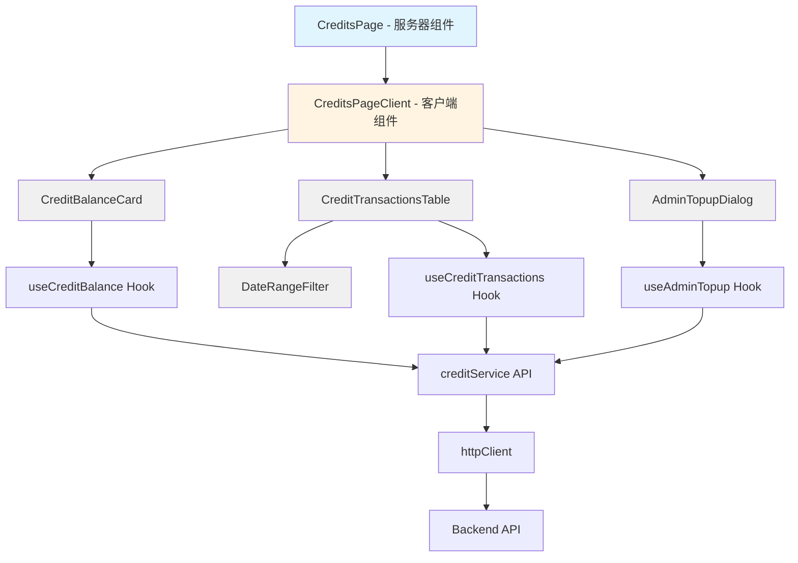
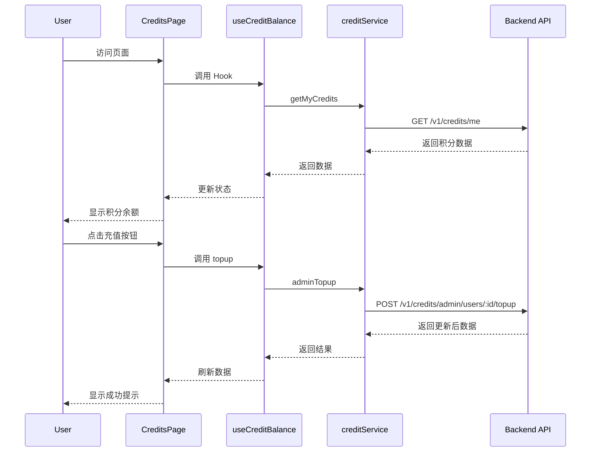

# 积分与额度管理页面设计方案

## 一、概述

本文档详细描述积分与额度管理页面（`/dashboard/credits`）的设计方案，包括组件架构、API集成、UI设计和实现细节。

## 二、页面功能需求

### 2.1 核心功能
1. **积分余额展示**：显示当前用户的积分余额、状态、每日限额
2. **积分流水记录**：分页展示积分变动历史，支持时间筛选
3. **流水详情**：显示每次调用的模型、tokens、扣费等详细信息
4. **管理员充值**：超级管理员可为用户充值积分（需权限检查，当前入口位于用户管理页面 `/system/users`，复用本模块的充值对话框组件）

### 2.2 相关API
- `GET /v1/credits/me` - 查询当前用户积分
- `GET /v1/credits/me/transactions` - 查询积分流水（支持分页）
- `POST /v1/credits/admin/users/{user_id}/topup` - 管理员充值（需超级用户权限）

### 2.3 概览&洞察新增 API
为了支撑积分概览、Provider 洞察与趋势卡片，新增以下接口：
- `GET /v1/credits/me/consumption/summary` - 返回指定时间范围内的积分消耗合计、日均消耗、剩余天数预测；
- `GET /v1/credits/me/consumption/providers` - 返回当前用户各 Provider 的积分消耗榜单（含交易次数、占比）；
- `GET /v1/credits/me/consumption/timeseries` - 返回按天聚合的积分消耗时间序列（用于 Micro-sparkline）。  
此外，可以复用现有 `/metrics/overview/*` 系列接口提取 Provider 成功率、延迟等运营指标。

## 三、技术架构

### 3.1 技术栈
- **框架**: Next.js 16.0 (App Router)
- **状态管理**: SWR (数据获取) + React Hooks
- **UI组件**: shadcn/ui + Tailwind CSS
- **类型安全**: TypeScript
- **国际化**: 自定义 i18n Context

### 3.2 目录结构
```
frontend/
├── app/dashboard/credits/
│   └── page.tsx                          # 页面主组件（服务器组件）
├── components/dashboard/credits/
│   ├── credit-balance-card.tsx           # 积分余额卡片
│   ├── credit-transactions-table.tsx     # 流水记录表格
│   ├── admin-topup-dialog.tsx            # 管理员充值对话框
│   └── date-range-filter.tsx             # 时间范围筛选器
├── http/
│   └── credit.ts                         # 积分API服务封装
├── lib/
│   ├── swr/use-credits.ts                # SWR hooks
│   └── api-types.ts                      # TypeScript类型定义
└── lib/i18n-context.tsx                  # 国际化翻译（更新）
```

## 四、组件设计

### 4.0 仪表盘概览模块

新版概览页在顶端增加多个「概览卡片 + 趋势」模块，对应用户反馈中的数据洞察诉求：

| 模块 | 说明 | 数据来源 |
| ---- | ---- | ---- |
| 积分消费概览卡片 | 显示所选时间范围（默认本月）内的消耗积分、剩余积分、平均单次消耗；底部放置近 7/30 天的 Micro-sparkline。 | `/v1/credits/me/consumption/summary` + `/v1/credits/me` + `/v1/credits/me/consumption/timeseries` |
| Provider 消耗排行榜 | 以表格/条形图列出各 Provider 的积分消耗、请求量、成功率、平均延迟，支持时间维度筛选。 | `/v1/credits/me/consumption/providers` + `/metrics/overview/providers` |
| 请求成功率 & 异常趋势 | 对比不同 Provider 的成功率、延迟，并标注异常峰值或错误码热点。 | `/metrics/overview/providers` + `/metrics/providers/timeseries` |
| 积分预警 / 预算模块 | 展示 Projected Burn（预计耗尽日期）、余额阈值提示及 CTA（跳转积分管理/充值）。 | `/v1/credits/me/consumption/summary` |
| 活跃模型 & 特殊事件 | 列出调用最多/失败最多的模型，提示限流或错误事件。 | `/metrics/overview/providers` + 未来的模型事件 API |
| 时间选择器/筛选器 | 支持日/周/月快捷切换，或按 Provider / 模型过滤数据，统一驱动上述模块。 | 组件级 `useState` + 相关 API 参数 |
| 快捷操作区 | 入口按钮：积分充值、Provider 管理、路由配置等高频任务。 | UI 快捷跳转 |

> 实现提示：  
> - 概览卡片采用 `@/components/ui/card` + `@/components/ui/chart`（或自定义 sparkline）封装，保证可复用。  
> - 时间筛选器与 `/v1/credits/me/consumption/*` 的 `time_range` 参数保持一致（支持 `today/7d/30d/90d/all`）。  
> - Provider 榜单可与 `OverviewActiveProviders` 数据结构整合，统一排序逻辑。

### 4.1 页面主组件 (page.tsx)

**职责**：
- 作为服务器组件，保持轻量
- 渲染页面布局和标题
- 组合各个子组件

**设计要点**：
```typescript
// 服务器组件，不包含客户端逻辑
export default function CreditsPage() {
  return (
    <div className="space-y-6 max-w-7xl">
      <PageHeader />
      <CreditsPageClient />
    </div>
  );
}
```

### 4.2 积分余额卡片 (CreditBalanceCard)

**功能**：
- 显示当前积分余额（大号数字）
- 显示账户状态（active/suspended）
- 显示每日限额（如果设置）
- 提供手动刷新按钮
- 可选：在需要时提供入口按钮打开管理员充值对话框（当前实现中，充值入口改为放在 `/system/users` 用户管理页面）

**UI设计**：
```
┌─────────────────────────────────────────┐
│ 积分余额                    [刷新] [充值]│
├─────────────────────────────────────────┤
│                                         │
│           1,200 积分                    │
│                                         │
│  状态: ● 正常    每日限额: 无限制        │
│                                         │
│  最后更新: 2分钟前                       │
└─────────────────────────────────────────┘
```

**性能优化**：
- 使用 `useMemo` 缓存格式化数据
- 使用 `useCallback` 优化事件处理器

### 4.3 积分流水表格 (CreditTransactionsTable)

**功能**：
- 分页展示流水记录（每页50条）
- 显示时间、金额、原因、模型、tokens
- 支持时间范围筛选
- 空状态友好提示

**表格列设计**：
| 列名 | 宽度 | 说明 |
|------|------|------|
| 时间 | 180px | 相对时间 + tooltip显示完整时间 |
| 金额 | 100px | 正数绿色，负数红色 |
| 原因 | 120px | usage/topup/refund等 |
| 描述 | 200px | 可选的详细说明 |
| 模型 | 150px | 模型名称 |
| Tokens | 180px | input/output/total |

**分页策略**：
- 使用传统页码分页（符合项目现有模式）
- 每页50条记录（与API默认一致）
- 显示总记录数和当前页码

**UI设计**：
```
┌─────────────────────────────────────────────────────────┐
│ 积分流水                                                │
│                                                         │
│ [今天] [本周] [本月] [最近30天] [自定义]  共 156 条记录 │
├─────────────────────────────────────────────────────────┤
│ 时间          金额    原因    模型         Tokens       │
├─────────────────────────────────────────────────────────┤
│ 2分钟前       -25    usage   gpt-4o-mini  800          │
│ 1小时前       -50    usage   gpt-4o       1200         │
│ 昨天          +1000  topup   -            -            │
├─────────────────────────────────────────────────────────┤
│                    [上一页] 1 / 4 [下一页]              │
└─────────────────────────────────────────────────────────┘
```

### 4.4 时间范围筛选器 (DateRangeFilter)

**功能**：
- 快捷选项：今天、本周、本月、最近7天、最近30天
- 自定义日期范围选择
- 清除筛选

**实现方式**：
- 使用 shadcn/ui 的 Select 组件
- 快捷选项直接计算时间范围
- 自定义选项可扩展为日期选择器

### 4.5 管理员充值对话框 (AdminTopupDialog)

**功能**：
- 仅超级管理员可见
- 输入充值金额（正整数）
- 输入充值说明（可选）
- 表单验证和错误提示

> 说明：当前 UI 中，该对话框主要由用户管理页面 `/system/users` 的“充值积分”操作按钮触发，用于为指定用户充值；如有需要，也可以在积分页面中复用该对话框。

**权限检查**：
```typescript
const user = useAuthStore(state => state.user);
const isSuperUser = user?.is_superuser === true;

if (!isSuperUser) return null; // 不渲染组件
```

**UI设计**：
```
┌─────────────────────────────────┐
│ 充值积分                        │
├─────────────────────────────────┤
│                                 │
│ 充值金额 *                      │
│ [1000____________]              │
│                                 │
│ 充值说明（可选）                │
│ [测试充值_________]             │
│                                 │
│         [取消]  [确认充值]      │
└─────────────────────────────────┘
```

## 五、数据流设计

### 5.1 SWR Hooks (use-credits.ts)

**设计原则**：
- 遵循项目现有的 SWR 模式
- 提供统一的数据获取和变更接口
- 自动处理加载、错误状态
- 支持手动刷新

**核心Hooks**：

```typescript
// 1. 获取积分余额
export const useCreditBalance = () => {
  const { data, error, loading, refresh } = useApiGet<CreditAccount>(
    '/v1/credits/me',
    { strategy: 'frequent' } // 频繁更新策略
  );
  
  return {
    balance: data,
    loading,
    error,
    refresh
  };
};

// 2. 获取积分流水（支持分页和筛选）
export const useCreditTransactions = (params: TransactionParams) => {
  const queryString = buildQueryString(params);
  const { data, error, loading, refresh } = useApiGet<CreditTransaction[]>(
    `/v1/credits/me/transactions?${queryString}`,
    { strategy: 'frequent' }
  );
  
  return {
    transactions: data || [],
    loading,
    error,
    refresh
  };
};

// 3. 管理员充值
export const useAdminTopup = () => {
  const topupMutation = useApiPost<CreditAccount, TopupRequest>('');
  
  const topup = useCallback(async (userId: string, data: TopupRequest) => {
    const url = `/v1/credits/admin/users/${userId}/topup`;
    return await topupMutation.trigger(data, { url });
  }, [topupMutation]);
  
  return {
    topup,
    submitting: topupMutation.submitting
  };
};
```

### 5.2 API服务封装 (credit.ts)

```typescript
import { httpClient } from './client';

export interface CreditAccount {
  id: string;
  user_id: string;
  balance: number;
  daily_limit: number | null;
  status: 'active' | 'suspended';
  created_at: string;
  updated_at: string;
}

export interface CreditTransaction {
  id: string;
  account_id: string;
  user_id: string;
  api_key_id: string | null;
  amount: number;
  reason: 'usage' | 'topup' | 'refund' | 'adjustment';
  description: string | null;
  model_name: string | null;
  input_tokens: number | null;
  output_tokens: number | null;
  total_tokens: number | null;
  created_at: string;
}

export interface TopupRequest {
  amount: number;
  description?: string;
}

export const creditService = {
  // 获取当前用户积分
  getMyCredits: async (): Promise<CreditAccount> => {
    const response = await httpClient.get('/v1/credits/me');
    return response.data;
  },

  // 获取积分流水
  getMyTransactions: async (params: {
    limit?: number;
    offset?: number;
  }): Promise<CreditTransaction[]> => {
    const response = await httpClient.get('/v1/credits/me/transactions', {
      params
    });
    return response.data;
  },

  // 管理员充值
  adminTopup: async (
    userId: string,
    data: TopupRequest
  ): Promise<CreditAccount> => {
    const response = await httpClient.post(
      `/v1/credits/admin/users/${userId}/topup`,
      data
    );
    return response.data;
  }
};
```

## 六、UI设计规范

### 6.1 设计风格
遵循项目的"水墨风格"设计语言：
- **极简主义**：最少元素，最大功能
- **留白充足**：元素间距24px
- **细线边框**：1px边框或微妙阴影
- **单色为主**：黑白灰 + 少量强调色

### 6.2 色彩方案
- **积分余额**：大号数字，深灰色 (#1a1a1a)
- **正数金额**：绿色 (#4CAF50)
- **负数金额**：红色 (#F44336)
- **状态指示**：
  - 正常：绿色圆点
  - 暂停：红色圆点
- **强调按钮**：深蓝 (#0066cc)

### 6.3 响应式设计
- **桌面 (≥1024px)**：完整布局，表格显示所有列
- **平板 (768-1023px)**：简化部分列，保持可读性
- **手机 (<768px)**：卡片式布局，堆叠显示

## 七、国际化支持

### 7.1 翻译键设计
```typescript
// 中文
"credits.title": "积分与额度",
"credits.subtitle": "管理您的积分余额和使用记录",
"credits.balance": "积分余额",
"credits.status": "状态",
"credits.daily_limit": "每日限额",
"credits.unlimited": "无限制",
"credits.refresh": "刷新",
"credits.topup": "充值",
"credits.transactions": "积分流水",
"credits.time": "时间",
"credits.amount": "金额",
"credits.reason": "原因",
"credits.description": "描述",
"credits.model": "模型",
"credits.tokens": "Tokens",
"credits.input_tokens": "输入",
"credits.output_tokens": "输出",
"credits.total_tokens": "总计",
"credits.filter_today": "今天",
"credits.filter_week": "本周",
"credits.filter_month": "本月",
"credits.filter_7days": "最近7天",
"credits.filter_30days": "最近30天",
"credits.filter_custom": "自定义",
"credits.total_records": "共 {count} 条记录",
"credits.empty": "暂无流水记录",
"credits.loading": "加载中...",
"credits.topup_dialog_title": "充值积分",
"credits.topup_amount": "充值金额",
"credits.topup_description": "充值说明（可选）",
"credits.topup_submit": "确认充值",
"credits.topup_success": "充值成功",
"credits.topup_error": "充值失败",
"credits.reason_usage": "使用扣费",
"credits.reason_topup": "充值",
"credits.reason_refund": "退款",
"credits.reason_adjustment": "调整",

// 英文
"credits.title": "Credits & Quota",
"credits.subtitle": "Manage your credit balance and usage history",
// ... 其他英文翻译
```

## 八、性能优化策略

### 8.1 组件优化
1. **React.memo**：包装纯展示组件
2. **useMemo**：缓存计算结果（格式化、筛选）
3. **useCallback**：稳定事件处理器引用
4. **代码分割**：大型组件懒加载

### 8.2 数据获取优化
1. **SWR缓存**：利用SWR的自动缓存机制
2. **条件请求**：仅在需要时发起请求
3. **防抖节流**：搜索和筛选操作防抖
4. **分页加载**：避免一次加载大量数据

### 8.3 渲染优化
1. **虚拟滚动**：如果记录数超过100条，考虑虚拟滚动
2. **骨架屏**：加载时显示骨架屏而非空白
3. **错误边界**：防止组件错误影响整个页面

## 九、错误处理

### 9.1 错误类型
1. **网络错误**：显示重试按钮
2. **权限错误**：隐藏管理员功能
3. **数据错误**：显示友好提示
4. **表单验证错误**：实时反馈

### 9.2 错误展示
- 使用 `toast` 显示操作结果
- 表格显示错误状态和重试按钮
- 表单显示字段级错误提示

## 十、测试策略

### 10.1 单元测试
- 测试数据格式化函数
- 测试筛选逻辑
- 测试权限检查

### 10.2 集成测试
- 测试完整的充值流程
- 测试分页和筛选交互
- 测试错误处理

### 10.3 可访问性测试
- 键盘导航
- 屏幕阅读器支持
- 颜色对比度

## 十一、实现优先级

### Phase 1: 核心功能（高优先级）
1. ✅ API服务封装和类型定义
2. ✅ SWR hooks实现
3. ✅ 积分余额卡片
4. ✅ 积分流水表格（基础版）
5. ✅ 页面主组件

### Phase 2: 增强功能（中优先级）
6. ✅ 时间范围筛选
7. ✅ 管理员充值功能
8. ✅ 国际化翻译
9. ✅ 响应式优化

### Phase 3: 优化完善（低优先级）
10. 性能优化（虚拟滚动等）
11. 高级筛选（按原因、模型等）
12. 数据导出功能
13. 图表可视化

## 十二、Mermaid架构图

### 12.1 组件关系图



### 12.2 数据流图



## 十三、总结

本设计方案遵循以下原则：
1. **符合项目规范**：遵循现有代码风格和架构模式
2. **组件化设计**：高内聚、低耦合、可复用
3. **性能优先**：优化渲染、减少不必要的请求
4. **用户体验**：简洁、直观、响应式
5. **可维护性**：清晰的代码结构、完善的类型定义
6. **可扩展性**：预留扩展接口，便于后续功能添加

该方案可直接用于开发实现，所有组件和API都已详细设计，可以无缝集成到现有项目中。
