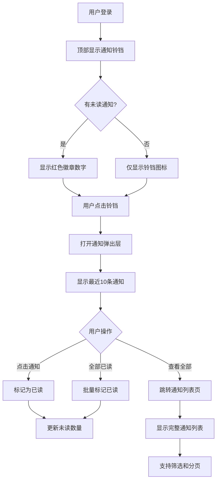
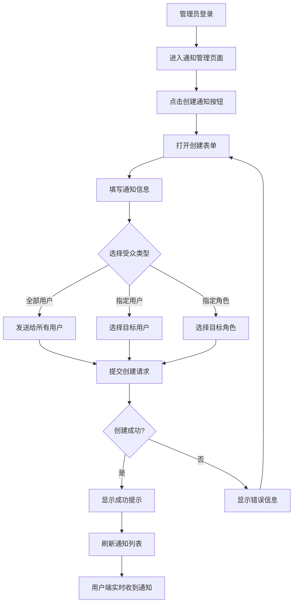

# 通知系统前端设计方案

## 概述

本文档详细描述 AI Higress 项目的通知系统前端实现方案，包括用户接收通知和管理员发送通知两大功能模块。

**设计原则**：
- 遵循项目的极简墨水风格设计规范
- 复用现有 shadcn/ui 组件
- 使用 SWR 进行数据管理
- 支持实时未读数量更新
- 完整的国际化支持

---

## 一、后端 API 概览

### 1.1 用户端 API

| 接口 | 方法 | 描述 |
|------|------|------|
| `/v1/notifications` | GET | 获取当前用户通知列表 |
| `/v1/notifications/unread-count` | GET | 获取未读通知数量 |
| `/v1/notifications/read` | POST | 批量标记通知为已读 |

**查询参数**：
- `status`: `all` \| `unread` (默认 `all`)
- `limit`: 1-200 (默认 50)
- `offset`: ≥0 (默认 0)

### 1.2 管理员 API

| 接口 | 方法 | 描述 |
|------|------|------|
| `/v1/admin/notifications` | POST | 创建通知/公告 |
| `/v1/admin/notifications` | GET | 查看已发布的通知列表 |

---

## 二、数据类型定义

### 2.1 TypeScript 类型（`frontend/lib/api-types.ts`）

```typescript
// ============= 通知相关 =============

export type NotificationLevel = 'info' | 'success' | 'warning' | 'error';
export type NotificationTargetType = 'all' | 'users' | 'roles';

export interface Notification {
  id: string;
  title: string;
  content: string;
  level: NotificationLevel;
  target_type: NotificationTargetType;
  target_user_ids: string[];
  target_role_codes: string[];
  link_url: string | null;
  expires_at: string | null;
  created_at: string;
  updated_at: string;
  created_by: string | null;
  is_read: boolean;
  read_at: string | null;
}

export interface NotificationAdminView {
  id: string;
  title: string;
  content: string;
  level: NotificationLevel;
  target_type: NotificationTargetType;
  target_user_ids: string[];
  target_role_codes: string[];
  link_url: string | null;
  expires_at: string | null;
  is_active: boolean;
  created_at: string;
  updated_at: string;
  created_by: string | null;
}

export interface CreateNotificationRequest {
  title: string;
  content: string;
  level?: NotificationLevel;
  target_type: NotificationTargetType;
  target_user_ids?: string[];
  target_role_codes?: string[];
  link_url?: string;
  expires_at?: string;
}

export interface MarkNotificationsReadRequest {
  notification_ids: string[];
}

export interface UnreadCountResponse {
  unread_count: number;
}

export interface NotificationQueryParams {
  status?: 'all' | 'unread';
  limit?: number;
  offset?: number;
}
```

---

## 三、SWR Hooks 设计

### 3.1 文件结构

创建 `frontend/lib/swr/use-notifications.ts`

### 3.2 Hook 实现

```typescript
import useSWR from 'swr';
import { useCallback, useMemo } from 'react';
import type {
  Notification,
  NotificationAdminView,
  NotificationQueryParams,
  CreateNotificationRequest,
  MarkNotificationsReadRequest,
  UnreadCountResponse,
} from '@/lib/api-types';

const API_BASE = process.env.NEXT_PUBLIC_API_BASE_URL || '';

// ============= 用户端 Hooks =============

/**
 * 获取当前用户的通知列表
 */
export function useNotifications(params?: NotificationQueryParams) {
  const queryString = useMemo(() => {
    const searchParams = new URLSearchParams();
    if (params?.status) searchParams.set('status', params.status);
    if (params?.limit) searchParams.set('limit', params.limit.toString());
    if (params?.offset) searchParams.set('offset', params.offset.toString());
    return searchParams.toString();
  }, [params]);

  const key = queryString 
    ? `/v1/notifications?${queryString}` 
    : '/v1/notifications';

  const { data, error, isLoading, mutate } = useSWR<Notification[]>(
    key,
    {
      revalidateOnFocus: true,
      revalidateOnReconnect: true,
    }
  );

  return {
    notifications: data,
    isLoading,
    isError: error,
    mutate,
  };
}

/**
 * 获取未读通知数量
 */
export function useUnreadCount() {
  const { data, error, isLoading, mutate } = useSWR<UnreadCountResponse>(
    '/v1/notifications/unread-count',
    {
      refreshInterval: 30000, // 每30秒自动刷新
      revalidateOnFocus: true,
    }
  );

  return {
    unreadCount: data?.unread_count ?? 0,
    isLoading,
    isError: error,
    mutate,
  };
}

/**
 * 标记通知为已读
 */
export function useMarkNotificationsRead() {
  const { mutate: mutateNotifications } = useNotifications();
  const { mutate: mutateUnreadCount } = useUnreadCount();

  const markAsRead = useCallback(
    async (notificationIds: string[]) => {
      const response = await fetch(`${API_BASE}/v1/notifications/read`, {
        method: 'POST',
        headers: {
          'Content-Type': 'application/json',
        },
        credentials: 'include',
        body: JSON.stringify({ notification_ids: notificationIds }),
      });

      if (!response.ok) {
        throw new Error('Failed to mark notifications as read');
      }

      // 刷新通知列表和未读数量
      await Promise.all([
        mutateNotifications(),
        mutateUnreadCount(),
      ]);

      return response.json();
    },
    [mutateNotifications, mutateUnreadCount]
  );

  return { markAsRead };
}

// ============= 管理员 Hooks =============

/**
 * 获取管理员通知列表
 */
export function useAdminNotifications(params?: { limit?: number; offset?: number }) {
  const queryString = useMemo(() => {
    const searchParams = new URLSearchParams();
    if (params?.limit) searchParams.set('limit', params.limit.toString());
    if (params?.offset) searchParams.set('offset', params.offset.toString());
    return searchParams.toString();
  }, [params]);

  const key = queryString
    ? `/v1/admin/notifications?${queryString}`
    : '/v1/admin/notifications';

  const { data, error, isLoading, mutate } = useSWR<NotificationAdminView[]>(
    key,
    {
      revalidateOnFocus: true,
    }
  );

  return {
    notifications: data,
    isLoading,
    isError: error,
    mutate,
  };
}

/**
 * 创建通知
 */
export function useCreateNotification() {
  const { mutate } = useAdminNotifications();

  const createNotification = useCallback(
    async (payload: CreateNotificationRequest) => {
      const response = await fetch(`${API_BASE}/v1/admin/notifications`, {
        method: 'POST',
        headers: {
          'Content-Type': 'application/json',
        },
        credentials: 'include',
        body: JSON.stringify(payload),
      });

      if (!response.ok) {
        const error = await response.json();
        throw new Error(error.detail || 'Failed to create notification');
      }

      // 刷新通知列表
      await mutate();

      return response.json();
    },
    [mutate]
  );

  return { createNotification };
}
```

---

## 四、UI 组件设计

### 4.1 组件结构

```
frontend/components/
├── layout/
│   └── notification-bell.tsx          # 顶部导航栏的通知铃铛图标
├── dashboard/
│   └── notifications/
│       ├── notification-list.tsx      # 通知列表（用户端）
│       ├── notification-item.tsx      # 单条通知卡片
│       ├── notification-popover.tsx   # 通知弹出层
│       ├── admin-notification-form.tsx # 管理员创建通知表单
│       └── admin-notifications-table.tsx # 管理员通知列表
```

### 4.2 通知铃铛组件（`notification-bell.tsx`）

**位置**：顶部导航栏右侧，用户头像左边

**功能**：
- 显示未读通知数量徽章
- 点击打开通知弹出层
- 实时更新未读数量

```typescript
"use client";

import { Bell } from "lucide-react";
import { Button } from "@/components/ui/button";
import {
  Popover,
  PopoverContent,
  PopoverTrigger,
} from "@/components/ui/popover";
import { Badge } from "@/components/ui/badge";
import { useUnreadCount } from "@/lib/swr/use-notifications";
import { NotificationPopover } from "@/components/dashboard/notifications/notification-popover";

export function NotificationBell() {
  const { unreadCount } = useUnreadCount();

  return (
    <Popover>
      <PopoverTrigger asChild>
        <Button variant="ghost" size="icon" className="relative">
          <Bell className="h-5 w-5" />
          {unreadCount > 0 && (
            <Badge 
              variant="destructive" 
              className="absolute -top-1 -right-1 h-5 w-5 flex items-center justify-center p-0 text-xs"
            >
              {unreadCount > 99 ? '99+' : unreadCount}
            </Badge>
          )}
        </Button>
      </PopoverTrigger>
      <PopoverContent className="w-96 p-0" align="end">
        <NotificationPopover />
      </PopoverContent>
    </Popover>
  );
}
```

### 4.3 通知弹出层（`notification-popover.tsx`）

**功能**：
- 显示最近的通知（最多10条）
- 支持标记单条/全部已读
- 提供"查看全部"链接

```typescript
"use client";

import { useState } from "react";
import { useRouter } from "next/navigation";
import { Button } from "@/components/ui/button";
import { ScrollArea } from "@/components/ui/scroll-area";
import { Separator } from "@/components/ui/separator";
import { useI18n } from "@/lib/i18n-context";
import { useNotifications, useMarkNotificationsRead } from "@/lib/swr/use-notifications";
import { NotificationItem } from "./notification-item";

export function NotificationPopover() {
  const { t } = useI18n();
  const router = useRouter();
  const { notifications, isLoading } = useNotifications({ limit: 10 });
  const { markAsRead } = useMarkNotificationsRead();
  const [marking, setMarking] = useState(false);

  const unreadNotifications = notifications?.filter(n => !n.is_read) || [];

  const handleMarkAllRead = async () => {
    if (unreadNotifications.length === 0) return;
    
    setMarking(true);
    try {
      await markAsRead(unreadNotifications.map(n => n.id));
    } catch (error) {
      console.error('Failed to mark all as read:', error);
    } finally {
      setMarking(false);
    }
  };

  const handleViewAll = () => {
    router.push('/dashboard/notifications');
  };

  return (
    <div className="flex flex-col">
      {/* 头部 */}
      <div className="flex items-center justify-between p-4">
        <h3 className="font-semibold">{t('notifications.title')}</h3>
        {unreadNotifications.length > 0 && (
          <Button
            variant="ghost"
            size="sm"
            onClick={handleMarkAllRead}
            disabled={marking}
          >
            {t('notifications.mark_all_read')}
          </Button>
        )}
      </div>
      
      <Separator />

      {/* 通知列表 */}
      <ScrollArea className="h-[400px]">
        {isLoading ? (
          <div className="p-4 text-center text-sm text-muted-foreground">
            {t('common.loading')}
          </div>
        ) : notifications && notifications.length > 0 ? (
          <div className="divide-y">
            {notifications.map((notification) => (
              <NotificationItem
                key={notification.id}
                notification={notification}
                compact
              />
            ))}
          </div>
        ) : (
          <div className="p-8 text-center text-sm text-muted-foreground">
            {t('notifications.no_notifications')}
          </div>
        )}
      </ScrollArea>

      <Separator />

      {/* 底部 */}
      <div className="p-2">
        <Button
          variant="ghost"
          className="w-full"
          onClick={handleViewAll}
        >
          {t('notifications.view_all')}
        </Button>
      </div>
    </div>
  );
}
```

### 4.4 通知项组件（`notification-item.tsx`）

**功能**：
- 显示通知标题、内容、时间
- 根据等级显示不同颜色
- 支持点击标记已读
- 支持跳转链接

```typescript
"use client";

import { useState } from "react";
import { formatDistanceToNow } from "date-fns";
import { zhCN, enUS } from "date-fns/locale";
import { Info, CheckCircle, AlertTriangle, XCircle, ExternalLink } from "lucide-react";
import { cn } from "@/lib/utils";
import { useI18n } from "@/lib/i18n-context";
import { useMarkNotificationsRead } from "@/lib/swr/use-notifications";
import type { Notification } from "@/lib/api-types";

interface NotificationItemProps {
  notification: Notification;
  compact?: boolean;
}

const levelIcons = {
  info: Info,
  success: CheckCircle,
  warning: AlertTriangle,
  error: XCircle,
};

const levelColors = {
  info: "text-blue-600 bg-blue-50",
  success: "text-green-600 bg-green-50",
  warning: "text-yellow-600 bg-yellow-50",
  error: "text-red-600 bg-red-50",
};

export function NotificationItem({ notification, compact = false }: NotificationItemProps) {
  const { t, language } = useI18n();
  const { markAsRead } = useMarkNotificationsRead();
  const [marking, setMarking] = useState(false);

  const Icon = levelIcons[notification.level];
  const locale = language === 'zh' ? zhCN : enUS;

  const handleClick = async () => {
    if (!notification.is_read && !marking) {
      setMarking(true);
      try {
        await markAsRead([notification.id]);
      } catch (error) {
        console.error('Failed to mark as read:', error);
      } finally {
        setMarking(false);
      }
    }

    if (notification.link_url) {
      window.open(notification.link_url, '_blank');
    }
  };

  return (
    <div
      className={cn(
        "p-4 cursor-pointer transition-colors hover:bg-muted/50",
        !notification.is_read && "bg-muted/20"
      )}
      onClick={handleClick}
    >
      <div className="flex gap-3">
        {/* 图标 */}
        <div className={cn("p-2 rounded-full flex-shrink-0", levelColors[notification.level])}>
          <Icon className="h-4 w-4" />
        </div>

        {/* 内容 */}
        <div className="flex-1 min-w-0">
          <div className="flex items-start justify-between gap-2">
            <h4 className={cn(
              "font-medium text-sm",
              !notification.is_read && "font-semibold"
            )}>
              {notification.title}
            </h4>
            {!notification.is_read && (
              <div className="h-2 w-2 rounded-full bg-blue-600 flex-shrink-0 mt-1" />
            )}
          </div>

          {!compact && (
            <p className="text-sm text-muted-foreground mt-1 line-clamp-2">
              {notification.content}
            </p>
          )}

          <div className="flex items-center gap-2 mt-2 text-xs text-muted-foreground">
            <span>
              {formatDistanceToNow(new Date(notification.created_at), {
                addSuffix: true,
                locale,
              })}
            </span>
            {notification.link_url && (
              <>
                <span>•</span>
                <ExternalLink className="h-3 w-3" />
              </>
            )}
          </div>
        </div>
      </div>
    </div>
  );
}
```

### 4.5 通知列表页面（`notification-list.tsx`）

**路径**：`/dashboard/notifications`

**功能**：
- 显示所有通知
- 支持筛选（全部/未读）
- 支持分页
- 批量标记已读

```typescript
"use client";

import { useState } from "react";
import { Card, CardContent, CardHeader, CardTitle } from "@/components/ui/card";
import { Button } from "@/components/ui/button";
import { Tabs, TabsContent, TabsList, TabsTrigger } from "@/components/ui/tabs";
import { useI18n } from "@/lib/i18n-context";
import { useNotifications, useMarkNotificationsRead } from "@/lib/swr/use-notifications";
import { NotificationItem } from "./notification-item";

export function NotificationList() {
  const { t } = useI18n();
  const [status, setStatus] = useState<'all' | 'unread'>('all');
  const { notifications, isLoading } = useNotifications({ status, limit: 50 });
  const { markAsRead } = useMarkNotificationsRead();
  const [marking, setMarking] = useState(false);

  const unreadNotifications = notifications?.filter(n => !n.is_read) || [];

  const handleMarkAllRead = async () => {
    if (unreadNotifications.length === 0) return;
    
    setMarking(true);
    try {
      await markAsRead(unreadNotifications.map(n => n.id));
    } catch (error) {
      console.error('Failed to mark all as read:', error);
    } finally {
      setMarking(false);
    }
  };

  return (
    <Card>
      <CardHeader>
        <div className="flex items-center justify-between">
          <CardTitle>{t('notifications.title')}</CardTitle>
          {unreadNotifications.length > 0 && (
            <Button
              variant="outline"
              size="sm"
              onClick={handleMarkAllRead}
              disabled={marking}
            >
              {t('notifications.mark_all_read')}
            </Button>
          )}
        </div>
      </CardHeader>
      <CardContent>
        <Tabs value={status} onValueChange={(v) => setStatus(v as 'all' | 'unread')}>
          <TabsList className="mb-4">
            <TabsTrigger value="all">
              {t('notifications.all')}
            </TabsTrigger>
            <TabsTrigger value="unread">
              {t('notifications.unread')}
              {unreadNotifications.length > 0 && (
                <span className="ml-2 px-2 py-0.5 text-xs bg-primary text-primary-foreground rounded-full">
                  {unreadNotifications.length}
                </span>
              )}
            </TabsTrigger>
          </TabsList>

          <TabsContent value={status} className="mt-0">
            {isLoading ? (
              <div className="py-8 text-center text-muted-foreground">
                {t('common.loading')}
              </div>
            ) : notifications && notifications.length > 0 ? (
              <div className="divide-y border rounded-lg">
                {notifications.map((notification) => (
                  <NotificationItem
                    key={notification.id}
                    notification={notification}
                  />
                ))}
              </div>
            ) : (
              <div className="py-12 text-center text-muted-foreground">
                {status === 'unread' 
                  ? t('notifications.no_unread') 
                  : t('notifications.no_notifications')}
              </div>
            )}
          </TabsContent>
        </Tabs>
      </CardContent>
    </Card>
  );
}
```

### 4.6 管理员创建通知表单（`admin-notification-form.tsx`）

**功能**：
- 创建系统通知/公告
- 支持选择受众类型
- 支持设置过期时间
- 表单验证

```typescript
"use client";

import { useState } from "react";
import { useForm } from "react-hook-form";
import { zodResolver } from "@hookform/resolvers/zod";
import * as z from "zod";
import { Button } from "@/components/ui/button";
import {
  Dialog,
  DialogContent,
  DialogDescription,
  DialogFooter,
  DialogHeader,
  DialogTitle,
  DialogTrigger,
} from "@/components/ui/dialog";
import {
  Form,
  FormControl,
  FormDescription,
  FormField,
  FormItem,
  FormLabel,
  FormMessage,
} from "@/components/ui/form";
import { Input } from "@/components/ui/input";
import { Textarea } from "@/components/ui/textarea";
import {
  Select,
  SelectContent,
  SelectItem,
  SelectTrigger,
  SelectValue,
} from "@/components/ui/select";
import { useI18n } from "@/lib/i18n-context";
import { useCreateNotification } from "@/lib/swr/use-notifications";
import { useToast } from "@/hooks/use-toast";
import { Plus } from "lucide-react";

const formSchema = z.object({
  title: z.string().min(1).max(200),
  content: z.string().min(1).max(4000),
  level: z.enum(['info', 'success', 'warning', 'error']),
  target_type: z.enum(['all', 'users', 'roles']),
  link_url: z.string().url().optional().or(z.literal('')),
});

type FormValues = z.infer<typeof formSchema>;

export function AdminNotificationForm() {
  const { t } = useI18n();
  const { toast } = useToast();
  const [open, setOpen] = useState(false);
  const { createNotification } = useCreateNotification();

  const form = useForm<FormValues>({
    resolver: zodResolver(formSchema),
    defaultValues: {
      title: '',
      content: '',
      level: 'info',
      target_type: 'all',
      link_url: '',
    },
  });

  const onSubmit = async (values: FormValues) => {
    try {
      await createNotification({
        ...values,
        link_url: values.link_url || undefined,
      });
      
      toast({
        title: t('notifications.create_success'),
        variant: 'default',
      });
      
      setOpen(false);
      form.reset();
    } catch (error) {
      toast({
        title: t('notifications.create_error'),
        description: error instanceof Error ? error.message : String(error),
        variant: 'destructive',
      });
    }
  };

  return (
    <Dialog open={open} onOpenChange={setOpen}>
      <DialogTrigger asChild>
        <Button>
          <Plus className="h-4 w-4 mr-2" />
          {t('notifications.create')}
        </Button>
      </DialogTrigger>
      <DialogContent className="max-w-2xl">
        <DialogHeader>
          <DialogTitle>{t('notifications.create_notification')}</DialogTitle>
          <DialogDescription>
            {t('notifications.create_description')}
          </DialogDescription>
        </DialogHeader>

        <Form {...form}>
          <form onSubmit={form.handleSubmit(onSubmit)} className="space-y-4">
            <FormField
              control={form.control}
              name="title"
              render={({ field }) => (
                <FormItem>
                  <FormLabel>{t('notifications.title_label')}</FormLabel>
                  <FormControl>
                    <Input {...field} placeholder={t('notifications.title_placeholder')} />
                  </FormControl>
                  <FormMessage />
                </FormItem>
              )}
            />

            <FormField
              control={form.control}
              name="content"
              render={({ field }) => (
                <FormItem>
                  <FormLabel>{t('notifications.content_label')}</FormLabel>
                  <FormControl>
                    <Textarea 
                      {...field} 
                      placeholder={t('notifications.content_placeholder')}
                      rows={5}
                    />
                  </FormControl>
                  <FormMessage />
                </FormItem>
              )}
            />

            <div className="grid grid-cols-2 gap-4">
              <FormField
                control={form.control}
                name="level"
                render={({ field }) => (
                  <FormItem>
                    <FormLabel>{t('notifications.level_label')}</FormLabel>
                    <Select onValueChange={field.onChange} defaultValue={field.value}>
                      <FormControl>
                        <SelectTrigger>
                          <SelectValue />
                        </SelectTrigger>
                      </FormControl>
                      <SelectContent>
                        <SelectItem value="info">{t('notifications.level_info')}</SelectItem>
                        <SelectItem value="success">{t('notifications.level_success')}</SelectItem>
                        <SelectItem value="warning">{t('notifications.level_warning')}</SelectItem>
                        <SelectItem value="error">{t('notifications.level_error')}</SelectItem>
                      </SelectContent>
                    </Select>
                    <FormMessage />
                  </FormItem>
                )}
              />

              <FormField
                control={form.control}
                name="target_type"
                render={({ field }) => (
                  <FormItem>
                    <FormLabel>{t('notifications.target_type_label')}</FormLabel>
                    <Select onValueChange={field.onChange} defaultValue={field.value}>
                      <FormControl>
                        <SelectTrigger>
                          <SelectValue />
                        </SelectTrigger>
                      </FormControl>
                      <SelectContent>
                        <SelectItem value="all">{t('notifications.target_all')}</SelectItem>
                        <SelectItem value="users">{t('notifications.target_users')}</SelectItem>
                        <SelectItem value="roles">{t('notifications.target_roles')}</SelectItem>
                      </SelectContent>
                    </Select>
                    <FormDescription>
                      {t('notifications.target_type_description')}
                    </FormDescription>
                    <FormMessage />
                  </FormItem>
                )}
              />
            </div>

            <FormField
              control={form.control}
              name="link_url"
              render={({ field }) => (
                <FormItem>
                  <FormLabel>{t('notifications.link_url_label')}</FormLabel>
                  <FormControl>
                    <Input {...field} placeholder="https://example.com" />
                  </FormControl>
                  <FormDescription>
                    {t('notifications.link_url_description')}
                  </FormDescription>
                  <FormMessage />
                </FormItem>
              )}
            />

            <DialogFooter>
              <Button type="button" variant="outline" onClick={() => setOpen(false)}>
                {t('common.cancel')}
              </Button>
              <Button type="submit" disabled={form.formState.isSubmitting}>
                {form.formState.isSubmitting ? t('common.creating') : t('common.create')}
              </Button>
            </DialogFooter>
          </form>
        </Form>
      </DialogContent>
    </Dialog>
  );
}
```

### 4.7 管理员通知列表（`admin-notifications-table.tsx`）

**功能**：
- 显示已发布的通知
- 显示受众类型和范围
- 显示创建时间和状态

```typescript
"use client";

import { Card, CardContent, CardHeader, CardTitle } from "@/components/ui/card";
import { Badge } from "@/components/ui/badge";
import {
  Table,
  TableBody,
  TableCell,
  TableHead,
  TableHeader,
  TableRow,
} from "@/components/ui/table";
import { useI18n } from "@/lib/i18n-context";
import { useAdminNotifications } from "@/lib/swr/use-notifications";
import { AdminNotificationForm } from "./admin-notification-form";
import { formatDistanceToNow } from "date-fns";
import { zhCN, enUS } from "date-fns/locale";

const levelColors = {
  info: "bg-blue-100 text-blue-700",
  success: "bg-green-100 text-green-700",
  warning: "bg-yellow-100 text-yellow-700",
  error: "bg-red-100 text-red-700",
};

export function AdminNotificationsTable() {
  const { t, language } = useI18n();
  const { notifications, isLoading } = useAdminNotifications({ limit: 50 });
  const locale = language === 'zh' ? zhCN : enUS;

  return (
    <Card>
      <CardHeader>
        <div className="flex items-center justify-between">
          <CardTitle>{t('notifications.admin_title')}</CardTitle>
          <AdminNotificationForm />
        </div>
      </CardHeader>
      <CardContent>
        {isLoading ? (
          <div className="py-8 text-center text-muted-foreground">
            {t('common.loading')}
          </div>
        ) : notifications && notifications.length > 0 ? (
          <Table>
            <TableHeader>
              <TableRow>
                <TableHead>{t('notifications.title_label')}</TableHead>
                <TableHead>{t('notifications.level_label')}</TableHead>
                <TableHead>{t('notifications.target_type_label')}</TableHead>
                <TableHead>{t('notifications.status')}</TableHead>
                <TableHead>{t('notifications.created_at')}</TableHead>
              </TableRow>
            </TableHeader>
            <TableBody>
              {notifications.map((notification) => (
                <TableRow key={notification.id}>
                  <TableCell className="font-medium max-w-md">
                    <div className="truncate">{notification.title}</div>
                    <div className="text-sm text-muted-foreground truncate mt-1">
                      {notification.content}
                    </div>
                  </TableCell>
                  <TableCell>
                    <Badge className={levelColors[notification.level]}>
                      {t(`notifications.level_${notification.level}`)}
                    </Badge>
                  </TableCell>
                  <TableCell>
                    {notification.target_type === 'all' && t('notifications.target_all')}
                    {notification.target_type === 'users' && 
                      `${notification.target_user_ids.length} ${t('notifications.users')}`}
                    {notification.target_type === 'roles' && 
                      notification.target_role_codes.join(', ')}
                  </TableCell>
                  <TableCell>
                    <Badge variant={notification.is_active ? "default" : "secondary"}>
                      {notification.is_active ? t('common.active') : t('common.inactive')}
                    </Badge>
                  </TableCell>
                  <TableCell className="text-sm text-muted-foreground">
                    {formatDistanceToNow(new Date(notification.created_at), {
                      addSuffix: true,
                      locale,
                    })}
                  </TableCell>
                </TableRow>
              ))}
            </TableBody>
          </Table>
        ) : (
          <div className="py-12 text-center text-muted-foreground">
            {t('notifications.no_notifications')}
          </div>
        )}
      </CardContent>
    </Card>
  );
}
```

---

## 五、国际化文案

### 5.1 创建 `frontend/lib/i18n/notifications.ts`

```typescript
import type { Language } from "../i18n-context";

export const notificationsTranslations: Record<Language, Record<string, string>> = {
  zh: {
    // 通用
    'notifications.title': '通知',
    'notifications.all': '全部',
    'notifications.unread': '未读',
    'notifications.no_notifications': '暂无通知',
    'notifications.no_unread': '暂无未读通知',
    'notifications.mark_all_read': '全部标为已读',
    'notifications.view_all': '查看全部',
    'notifications.users': '个用户',
    
    // 等级
    'notifications.level_label': '通知等级',
    'notifications.level_info': '信息',
    'notifications.level_success': '成功',
    'notifications.level_warning': '警告',
    'notifications.level_error': '错误',
    
    // 受众
    'notifications.target_type_label': '受众类型',
    'notifications.target_all': '全部用户',
    'notifications.target_users': '指定用户',
    'notifications.target_roles': '指定角色',
    'notifications.target_type_description': '选择通知的目标受众',
    
    // 创建表单
    'notifications.create': '创建通知',
    'notifications.create_notification': '创建新通知',
    'notifications.create_description': '向用户发送系统通知或公告',
    'notifications.title_label': '标题',
    'notifications.title_placeholder': '输入通知标题',
    'notifications.content_label': '内容',
    'notifications.content_placeholder': '输入通知内容',
    'notifications.link_url_label': '跳转链接（可选）',
    'notifications.link_url_description': '点击通知时跳转的URL',
    'notifications.create_success': '通知创建成功',
    'notifications.create_error': '通知创建失败',
    
    // 管理员
    'notifications.admin_title': '通知管理',
    'notifications.status': '状态',
    'notifications.created_at': '创建时间',
  },
  en: {
    // Common
    'notifications.title': 'Notifications',
    'notifications.all': 'All',
    'notifications.unread': 'Unread',
    'notifications.no_notifications': 'No notifications',
    'notifications.no_unread': 'No unread notifications',
    'notifications.mark_all_read': 'Mark all as read',
    'notifications.view_all': 'View all',
    'notifications.users': 'users',
    
    // Levels
    'notifications.level_label': 'Level',
    'notifications.level_info': 'Info',
    'notifications.level_success': 'Success',
    'notifications.level_warning': 'Warning',
    'notifications.level_error': 'Error',
    
    // Target
    'notifications.target_type_label': 'Target Type',
    'notifications.target_all': 'All Users',
    'notifications.target_users': 'Specific Users',
    'notifications.target_roles': 'Specific Roles',
    'notifications.target_type_description': 'Select the target audience for this notification',
    
    // Create Form
    'notifications.create': 'Create Notification',
    'notifications.create_notification': 'Create New Notification',
    'notifications.create_description': 'Send system notifications or announcements to users',
    'notifications.title_label': 'Title',
    'notifications.title_placeholder': 'Enter notification title',
    'notifications.content_label': 'Content',
    'notifications.content_placeholder': 'Enter notification content',
    'notifications.link_url_label': 'Link URL (Optional)',
    'notifications.link_url_description': 'URL to navigate when notification is clicked',
    'notifications.create_success': 'Notification created successfully',
    'notifications.create_error': 'Failed to create notification',
    
    // Admin
    'notifications.admin_title': 'Notification Management',
    'notifications.status': 'Status',
    'notifications.created_at': 'Created At',
  },
};
```

### 5.2 更新 `frontend/lib/i18n/index.ts`

在文件中添加：

```typescript
import { notificationsTranslations } from "./notifications";

// 在 mergeTranslations 中添加
export const allTranslations = mergeTranslations(
  // ... 其他翻译
  notificationsTranslations
);

// 在 export 中添加
export {
  // ... 其他导出
  notificationsTranslations,
};
```

---

## 六、路由配置

### 6.1 用户端路由

创建 `frontend/app/dashboard/notifications/page.tsx`：

```typescript
import { NotificationList } from "@/components/dashboard/notifications/notification-list";

export default function NotificationsPage() {
  return (
    <div className="container mx-auto py-6">
      <NotificationList />
    </div>
  );
}
```

### 6.2 管理员路由

创建 `frontend/app/system/notifications/page.tsx`：

```typescript
import { AdminNotificationsTable } from "@/components/dashboard/notifications/admin-notifications-table";

export default function AdminNotificationsPage() {
  return (
    <div className="container mx-auto py-6">
      <AdminNotificationsTable />
    </div>
  );
}
```

---

## 七、导航菜单集成

### 7.1 在顶部导航栏添加通知铃铛

修改 `frontend/components/layout/header.tsx` 或相应的导航组件：

```typescript
import { NotificationBell } from "@/components/layout/notification-bell";

// 在用户头像左边添加
<NotificationBell />
```

### 7.2 在侧边栏添加通知菜单项

在用户仪表盘导航中添加：

```typescript
{
  name: t('notifications.title'),
  href: '/dashboard/notifications',
  icon: Bell,
}
```

在系统管理导航中添加（仅管理员可见）：

```typescript
{
  name: t('notifications.admin_title'),
  href: '/system/notifications',
  icon: Bell,
}
```

---

## 八、shadcn/ui 组件依赖

需要安装以下 shadcn/ui 组件（如果尚未安装）：

```bash
cd frontend
bunx shadcn@latest add badge
bunx shadcn@latest add popover
bunx shadcn@latest add scroll-area
bunx shadcn@latest add tabs
bunx shadcn@latest add dialog
bunx shadcn@latest add form
bunx shadcn@latest add textarea
bunx shadcn@latest add select
bunx shadcn@latest add table
```

---

## 九、实现步骤建议

### 阶段一：基础设施（1-2天）

1. ✅ 添加类型定义到 `api-types.ts`
2. ✅ 创建 SWR Hooks (`use-notifications.ts`)
3. ✅ 添加国际化文案 (`notifications.ts`)
4. ✅ 安装必要的 shadcn/ui 组件

### 阶段二：用户端功能（2-3天）

1. ✅ 实现通知铃铛组件 (`notification-bell.tsx`)
2. ✅ 实现通知弹出层 (`notification-popover.tsx`)
3. ✅ 实现通知项组件 (`notification-item.tsx`)
4. ✅ 实现通知列表页面 (`notification-list.tsx`)
5. ✅ 集成到顶部导航栏
6. ✅ 添加路由和导航菜单

### 阶段三：管理员功能（2-3天）

1. ✅ 实现创建通知表单 (`admin-notification-form.tsx`)
2. ✅ 实现管理员通知列表 (`admin-notifications-table.tsx`)
3. ✅ 添加路由和导航菜单
4. ✅ 权限控制（仅超级管理员可见）

### 阶段四：测试与优化（1-2天）

1. ✅ 功能测试
2. ✅ 响应式布局测试
3. ✅ 国际化测试
4. ✅ 性能优化
5. ✅ 用户体验优化

---

## 十、设计亮点

### 10.1 极简设计

- 遵循墨水风格，使用细线和留白
- 通知等级用简单的图标和颜色区分
- 避免过度装饰，突出内容本身

### 10.2 实时更新

- 未读数量每30秒自动刷新
- 标记已读后立即更新UI
- 使用 SWR 的乐观更新提升体验

### 10.3 渐进式展示

- 弹出层显示最近10条
- 完整列表支持分页
- 支持未读/全部筛选

### 10.4 无障碍设计

- 键盘导航支持
- 屏幕阅读器友好
- 清晰的视觉层次

---

## 十一、注意事项

### 11.1 性能考虑

- 通知列表使用虚拟滚动（如果数量很大）
- 图片懒加载
- 合理的缓存策略

### 11.2 安全考虑

- XSS 防护：通知内容需要转义
- 权限验证：管理员功能需要权限检查
- 敏感信息：不在前端暴露用户ID等敏感数据

### 11.3 用户体验

- 加载状态提示
- 错误处理和提示
- 空状态友好提示
- 操作反馈及时

---

## 十二、未来扩展

### 12.1 高级功能

- 通知分类/标签
- 通知搜索
- 通知归档
- 通知偏好设置

### 12.2 实时推送

- WebSocket 实时推送
- 浏览器通知 API
- 邮件通知集成

### 12.3 数据分析

- 通知阅读率统计
- 用户参与度分析
- A/B 测试支持

---

## 附录：Mermaid 流程图

### 用户接收通知流程



### 管理员发送通知流程



---

**文档版本**: 1.0  
**最后更新**: 2025-12-07  
**作者**: AI Architect