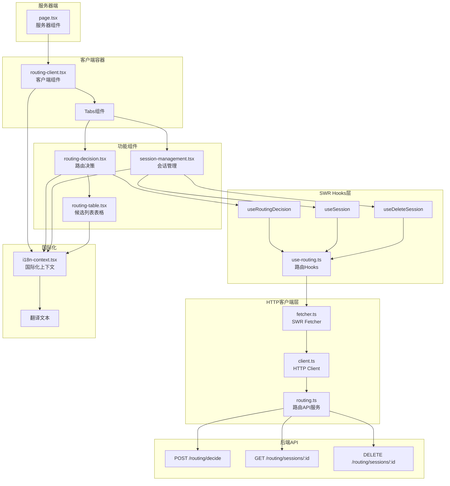
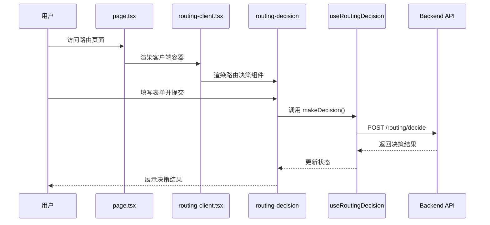

# 路由页面技术架构

## 整体架构图



## 数据流图



## 组件层次结构

```
app/dashboard/routing/
│
├── page.tsx (服务器组件)
│   └── 提供页面布局和标题
│
└── components/
    │
    ├── routing-client.tsx (客户端容器)
    │   ├── 使用 useI18n() 获取翻译
    │   ├── 管理 Tabs 状态
    │   └── 渲染子组件
    │
    ├── routing-decision.tsx (路由决策)
    │   ├── 使用 useRoutingDecision() Hook
    │   ├── 使用 useApiGet() 获取逻辑模型列表
    │   ├── 表单输入和验证
    │   ├── 调用决策API
    │   └── 展示决策结果
    │       └── routing-table.tsx (候选列表)
    │
    └── session-management.tsx (会话管理)
        ├── 使用 useSession() Hook
        ├── 使用 useDeleteSession() Hook
        ├── 会话ID输入
        ├── 查询会话信息
        └── 删除会话操作
```

## 状态管理策略

### 1. 路由决策组件状态

```typescript
// 本地状态
const [formData, setFormData] = useState({
  logical_model: '',
  strategy: 'balanced',
  conversation_id: '',
  preferred_region: '',
  exclude_providers: []
});

// SWR状态
const { 
  makeDecision,    // 触发函数
  decision,        // 决策结果
  error,          // 错误信息
  loading         // 加载状态
} = useRoutingDecision();

// 逻辑模型列表
const { 
  data: models,
  loading: modelsLoading 
} = useApiGet('/logical-models');
```

### 2. 会话管理组件状态

```typescript
// 本地状态
const [conversationId, setConversationId] = useState('');

// SWR状态
const { 
  session,        // 会话信息
  error,          // 错误信息
  loading,        // 加载状态
  refresh         // 刷新函数
} = useSession(conversationId);

const { 
  deleteSession,  // 删除函数
  deleting        // 删除中状态
} = useDeleteSession();
```

## API集成方案

### 1. SWR Hooks封装

```typescript
// frontend/lib/swr/use-routing.ts

import { useApiGet, useApiPost, useApiDelete } from './hooks';
import type { 
  RoutingDecisionRequest, 
  RoutingDecisionResponse,
  SessionInfo 
} from '@/http/routing';

// 路由决策Hook
export const useRoutingDecision = () => {
  const { trigger, data, error, submitting } = useApiPost<
    RoutingDecisionResponse,
    RoutingDecisionRequest
  >('/routing/decide');
  
  return {
    makeDecision: trigger,
    decision: data,
    error,
    loading: submitting,
  };
};

// 会话信息Hook
export const useSession = (conversationId: string | null) => {
  const { data, error, loading, refresh } = useApiGet<SessionInfo>(
    conversationId ? `/routing/sessions/${conversationId}` : null,
    { strategy: 'default' } // 不需要自动刷新
  );
  
  return {
    session: data,
    error,
    loading,
    refresh,
  };
};

// 删除会话Hook
export const useDeleteSession = () => {
  const { trigger, submitting } = useApiDelete('/routing/sessions');
  
  return {
    deleteSession: async (conversationId: string) => {
      await trigger(); // 实际URL会在调用时拼接
      // 或者使用动态URL
    },
    deleting: submitting,
  };
};
```

### 2. 错误处理策略

```typescript
// 在组件中统一处理错误
const { makeDecision, error } = useRoutingDecision();

useEffect(() => {
  if (error) {
    toast.error(
      error.response?.data?.detail || 
      t('routing.error.decision_failed')
    );
  }
}, [error]);
```

## 国际化实现

### 1. 翻译键命名规范

```
routing.{section}.{element}

例如:
- routing.decision.title
- routing.decision.btn_decide
- routing.session.search_placeholder
```

### 2. 使用方式

```typescript
"use client";

import { useI18n } from '@/lib/i18n-context';

export function RoutingDecision() {
  const { t } = useI18n();
  
  return (
    <Card>
      <CardHeader>
        <CardTitle>{t('routing.decision.title')}</CardTitle>
        <CardDescription>
          {t('routing.decision.description')}
        </CardDescription>
      </CardHeader>
      {/* ... */}
    </Card>
  );
}
```

## 性能优化策略

### 1. 避免不必要的重新渲染

```typescript
// 使用 React.memo 包装纯展示组件
export const RoutingTable = React.memo(({ candidates }) => {
  // ...
});

// 使用 useCallback 缓存回调函数
const handleDecision = useCallback(async (data) => {
  await makeDecision(data);
}, [makeDecision]);
```

### 2. SWR缓存策略

```typescript
// 路由决策不需要缓存（每次都是新的决策）
const { makeDecision } = useRoutingDecision();

// 会话信息可以短暂缓存
const { session } = useSession(conversationId, {
  revalidateOnFocus: false,
  dedupingInterval: 5000, // 5秒内不重复请求
});
```

### 3. 懒加载和代码分割

```typescript
// 使用动态导入减少初始加载
const RoutingTable = dynamic(
  () => import('./routing-table'),
  { loading: () => <Skeleton /> }
);
```

## 测试策略

### 1. 单元测试

```typescript
// 测试SWR Hooks
describe('useRoutingDecision', () => {
  it('should make routing decision', async () => {
    const { result } = renderHook(() => useRoutingDecision());
    
    await act(async () => {
      await result.current.makeDecision({
        logical_model: 'gpt-4',
        strategy: 'balanced'
      });
    });
    
    expect(result.current.decision).toBeDefined();
  });
});
```

### 2. 集成测试

```typescript
// 测试完整的用户流程
describe('Routing Page', () => {
  it('should make decision and display results', async () => {
    render(<RoutingPage />);
    
    // 填写表单
    fireEvent.change(screen.getByLabelText('Logical Model'), {
      target: { value: 'gpt-4' }
    });
    
    // 提交
    fireEvent.click(screen.getByText('Make Decision'));
    
    // 验证结果
    await waitFor(() => {
      expect(screen.getByText('Decision Result')).toBeInTheDocument();
    });
  });
});
```

## 部署注意事项

1. **环境变量**: 确保API基础URL正确配置
2. **认证**: 确保所有请求都包含有效的认证令牌
3. **错误监控**: 集成错误追踪服务（如Sentry）
4. **性能监控**: 监控API响应时间和成功率
5. **日志记录**: 记录关键操作和错误信息

## 维护指南

### 添加新功能

1. 在 `use-routing.ts` 中添加新的Hook
2. 创建对应的组件
3. 在 `routing-client.tsx` 中集成
4. 添加国际化翻译
5. 编写测试用例

### 修改现有功能

1. 更新相关Hook或组件
2. 更新类型定义
3. 更新国际化文本
4. 更新测试用例
5. 更新文档

### 调试技巧

1. 使用React DevTools查看组件状态
2. 使用SWR DevTools查看缓存状态
3. 使用Network面板查看API请求
4. 检查Console中的错误日志
5. 使用断点调试复杂逻辑