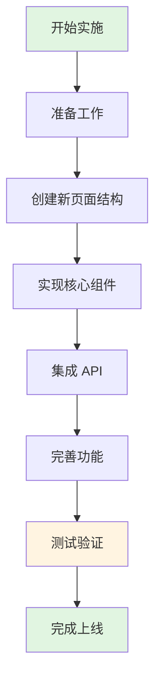
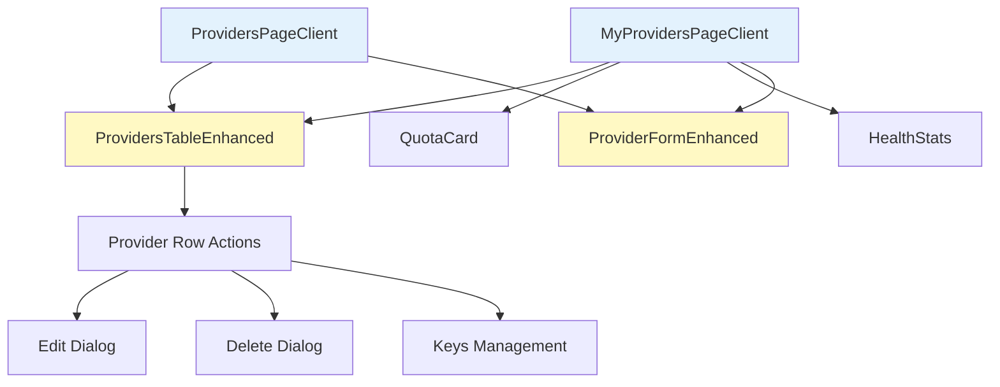
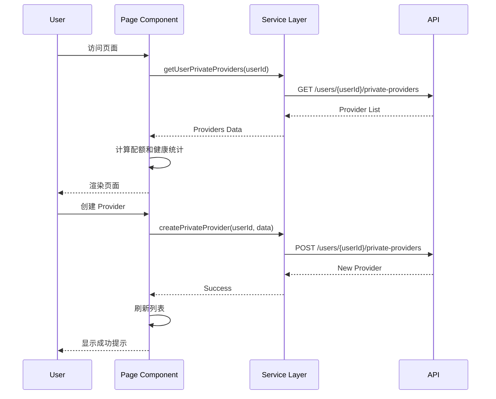

# 私有提供商管理页面实施计划

## 一、实施策略

**重要说明**：由于网页尚未上线，无需考虑向后兼容问题，因此采用**一次性重构**策略，直接实现完整的最终版本。

本方案将所有功能合并为一个完整的实施周期，预计 **5-6 天**完成。

## 二、实施任务（一次性完成）

### 总体目标

一次性完成以下所有功能：
1. ✅ 重构 `/dashboard/providers` 为 Provider 目录页
2. ✅ 新建 `/dashboard/my-providers` 私有管理中心
3. ✅ 实现配额管理和健康状态统计
4. ✅ 统一 API 调用
5. ✅ 完善权限控制
6. ✅ 添加批量操作和高级功能

**总工作量**：5-6 天

### 实施流程图



## 三、详细任务清单

### Day 1: 准备工作和页面结构 (1天)

#### 1. 更新国际化文案 (2小时)
   - [ ] 在 `lib/i18n/providers.ts` 中添加新的翻译 key
   - [ ] 更新现有文案使其更明确（目录 vs 管理）
   - [ ] 添加权限相关提示文案

#### 2. 创建页面文件结构 (2小时)
   ```
   frontend/app/dashboard/my-providers/
   ├── page.tsx
   └── components/
       ├── my-providers-page-client.tsx
       ├── quota-card.tsx
       └── health-stats.tsx
   ```
   - [ ] 创建服务端页面 `page.tsx`
   - [ ] 创建客户端组件目录
   - [ ] 设置页面元数据

#### 3. 更新导航 (1小时)
   - [ ] 更新 `sidebar-nav.tsx` 添加"我的 Provider"
   - [ ] 添加导航图标
   - [ ] 更新导航国际化文案

#### 4. 调整现有 Provider 目录页 (3小时)
   - [ ] 更新 `ProvidersPageClient` 的 Title/Subtitle
   - [ ] 修改页面描述文案，明确为"Provider 目录"
   - [ ] 在 `ProvidersTableEnhanced` 中强化权限控制
   - [ ] 移除公共 Provider 的编辑/删除按钮

---

### Day 2-3: 核心组件实现 (2天)

#### 5. 实现配额卡片组件 (4小时)
   - [ ] 创建 `QuotaCard` 组件
   - [ ] 实现配额数据展示（当前/上限）
   - [ ] 添加进度条可视化
   - [ ] 实现配额预警（>80% 显示警告）
   - [ ] 添加加载和错误状态

#### 6. 实现健康状态统计组件 (4小时)
   - [ ] 创建 `HealthStats` 组件
   - [ ] 实现状态聚合逻辑（Healthy/Degraded/Down）
   - [ ] 实现状态颜色编码
   - [ ] 添加简单的可视化展示

#### 7. 实现私有管理页主组件 (1天)
   - [ ] 创建 `MyProvidersPageClient` 组件
   - [ ] 集成配额卡片和健康统计
   - [ ] 复用 `ProvidersTableEnhanced`（固定 private filter）
   - [ ] 实现搜索和筛选功能
   - [ ] 添加创建按钮和表单集成
   - [ ] 实现刷新逻辑

---

### Day 4: API 集成和权限控制 (1天)

#### 8. 统一 API 调用 (4小时)
   - [ ] 修改 `ProviderFormEnhanced` 使用 `providerService.createPrivateProvider(userId, data)`
   - [ ] 从 `useAuthStore` 获取当前用户 ID
   - [ ] 更新所有 CRUD 操作使用用户级别 API
   - [ ] 更新错误处理逻辑

#### 9. 完善权限控制 (2小时)
   - [ ] 在 `ProvidersTableEnhanced` 中完善 `canModify` 函数
   - [ ] 确保密钥管理按钮只对有权限的用户显示
   - [ ] 添加权限提示（hover tooltip）

#### 10. 集成配额 API (2小时)
   - [ ] 确认配额 API 是否存在
   - [ ] 实现前端配额数据获取
   - [ ] 添加 SWR 缓存策略
   - [ ] 处理 API 错误情况

---

### Day 5: 高级功能 (1天)

#### 11. 批量操作功能 (3小时)
   - [ ] 添加批量选择 UI（Checkbox）
   - [ ] 实现批量健康检查
   - [ ] 实现批量删除（带确认）
   - [ ] 添加操作进度提示

#### 12. 高级筛选功能 (2小时)
   - [ ] 添加状态筛选器（Healthy/Degraded/Down）
   - [ ] 添加区域筛选器（如果有）
   - [ ] 实现筛选器组合逻辑

#### 13. 快速创建和优化 (3小时)
   - [ ] 在配额卡片添加"快速创建"按钮
   - [ ] 实现常用预设的快捷入口
   - [ ] 添加骨架屏加载状态
   - [ ] 优化组件渲染性能

---

### Day 6: 测试和完善 (1天)

#### 14. 全面测试 (4小时)
   - [ ] 测试私有 Provider 的 CRUD 操作
   - [ ] 测试公共 Provider 的只读访问
   - [ ] 测试权限边界情况
   - [ ] 测试配额显示正确性
   - [ ] 测试健康状态统计准确性
   - [ ] 测试页面响应式布局
   - [ ] 测试所有交互功能
   - [ ] 性能测试（大量 Provider 场景）

#### 15. 文档和收尾 (2小时)
   - [ ] 更新用户文档
   - [ ] 添加代码注释
   - [ ] 清理调试代码
   - [ ] 准备上线

#### 16. 最终验收 (2小时)
   - [ ] 功能完整性检查
   - [ ] UI/UX 检查
   - [ ] 性能检查
   - [ ] 准备部署

---

## 四、组件依赖关系

### 组件依赖关系



### 数据流



## 四、技术栈和工具

### 前端技术

- **框架**: Next.js 14 (App Router)
- **UI 组件**: shadcn/ui
- **状态管理**: Zustand (useAuthStore)
- **数据获取**: SWR
- **表单**: React Hook Form + Zod
- **样式**: Tailwind CSS
- **图标**: Lucide React

### 开发工具

- **代码编辑器**: VSCode
- **包管理器**: bun
- **版本控制**: Git
- **API 测试**: 浏览器 DevTools / Postman

### 质量保证

- **类型检查**: TypeScript
- **代码规范**: ESLint
- **格式化**: Prettier
- **测试**: Jest + React Testing Library（可选）

## 五、风险评估和应对

### 风险点

1. **API 不完整**
   - 风险：配额 API 可能不存在
   - 应对：先使用前端计算，后续接入真实 API

2. **权限系统复杂**
   - 风险：权限判断逻辑可能有遗漏
   - 应对：编写详细的权限测试用例

3. **性能问题**
   - 风险：大量 Provider 时页面卡顿
   - 应对：实现虚拟滚动和分页

4. **向后兼容**
   - 风险：旧代码可能依赖现有结构
   - 应对：渐进式重构，保持 API 兼容

### 回滚方案

- 阶段一：可快速回滚到原有实现
- 阶段二：新页面独立，不影响原有功能
- 阶段三：功能可选，可逐步启用

## 六、验收标准

### 阶段一验收

- [ ] Provider 目录页文案明确
- [ ] 公共 Provider 无编辑/删除入口
- [ ] 私有 Provider 权限控制正确
- [ ] API 调用统一使用用户级别接口
- [ ] 所有功能正常工作

### 阶段二验收

- [ ] 私有管理页可正常访问
- [ ] 配额显示准确
- [ ] 健康统计正确
- [ ] 导航集成完整
- [ ] 响应式布局正常
- [ ] 所有 CRUD 操作正常

### 阶段三验收

- [ ] 批量操作功能正常
- [ ] 高级筛选工作正常
- [ ] 快速创建模板可用
- [ ] 导出功能正常
- [ ] 性能满足要求（<3s 加载）

## 七、时间估算

| 阶段 | 工作量 | 开发时间 | 测试时间 | 总计 |
|------|--------|----------|----------|------|
| 阶段一 | 2-3天 | 2天 | 0.5天 | 2.5天 |
| 阶段二 | 3-4天 | 3天 | 1天 | 4天 |
| 阶段三 | 2-3天 | 2天 | 0.5天 | 2.5天 |
| **总计** | **7-10天** | **7天** | **2天** | **9天** |

### 里程碑

- **Week 1**: 完成阶段一，上线基础重构版本
- **Week 2**: 完成阶段二，上线私有管理页
- **Week 3**: 完成阶段三，上线完整功能

## 八、后续维护

### 监控指标

- 页面加载时间
- API 调用成功率
- 用户操作错误率
- 配额使用情况

### 优化方向

1. **用户反馈收集**
   - 添加反馈按钮
   - 收集使用数据
   - 定期用户访谈

2. **功能迭代**
   - 根据使用数据优化 UI
   - 添加用户请求的功能
   - 持续性能优化

3. **文档更新**
   - 保持技术文档同步
   - 更新用户手册
   - 维护 API 文档

## 九、团队协作

### 角色分工

- **前端开发**: 实现页面和组件
- **后端开发**: 提供/完善 API
- **UI/UX**: 设计评审和优化
- **测试**: 功能测试和回归测试
- **产品**: 需求确认和验收

### 沟通机制

- **每日站会**: 同步进度和问题
- **代码评审**: PR 必须经过 Review
- **文档更新**: 及时更新设计文档
- **问题跟踪**: 使用 Issue 管理任务

## 十、总结

本实施计划采用**渐进式重构**策略，分三个阶段完成私有提供商管理页面的重构：

1. **阶段一（2.5天）**: 快速修复当前问题，明确页面职责
2. **阶段二（4天）**: 创建独立的私有管理中心，提供完整功能
3. **阶段三（2.5天）**: 增强用户体验，添加高级功能

每个阶段都可以独立上线，降低风险，确保项目稳步推进。

---

**文档版本**: 1.0  
**创建日期**: 2025-12-05  
**预计完成**: 2025-12-14  
**负责人**: 开发团队